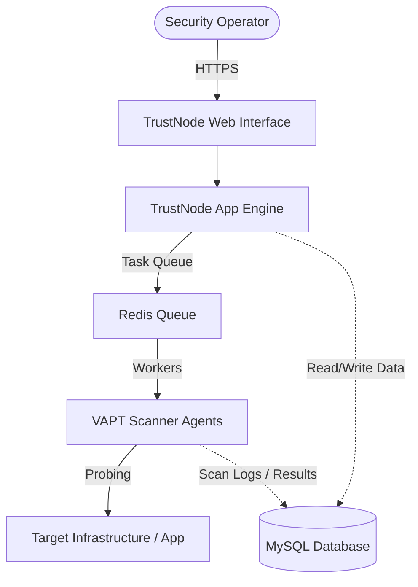

# TrustNode

[](LICENSE)
[](https://github.com/trustnode-org/trustnode/actions)
[](SECURITY.md)

**TrustNode** is an enterprise-grade self-hosted AI-powered VAPT (Vulnerability Assessment and Penetration Testing) platform. It empowers security teams and developers to automate vulnerability scanning, perform AI-assisted penetration tests, and manage system security postures from a unified, secure, and self-hosted environment.

This repository hosts the **Community Edition (CE)** of TrustNode, designed for independent researchers, developers, and small teams looking for a reliable, open-source security assessment baseline.

---

## Key Features

- **Automated VAPT Pipelines**: Run end-to-end vulnerability scanning for web applications, APIs, and infrastructure.
- **AI-Assisted Diagnostics**: Leverage localized LLM capabilities to triage scan results, weed out false positives, and suggest code-level remediation.
- **Docker-First Architecture**: Deploy instantly on your own infrastructure with minimal configuration.
- **Developer-Friendly Integrations**: Export findings to standard formats or trigger scans via a RESTful API.
- **Security-First Design**: Run entirely on-premise or in your private cloud, ensuring that sensitive scanning data never leaves your perimeter.

---

## High-Level Architecture

TrustNode Community Edition is structured to run securely within your own network isolation. The high-level deployment architecture consists of:



*Note: For security reasons, scan agents run as independent subprocesses, minimizing the main web application's permission footprint.*

---

## Community vs. Professional Edition

TrustNode Community Edition is fully functional, self-contained, and open-source. For advanced team features, compliance reporting, and real-time licensing management, consider **TrustNode Professional**.

| Feature | Community Edition (Open Source) | Professional Edition (Proprietary Companion) |
| :--- | :---: | :---: |
| **Self-Hosted Deployment** | :white_check_mark: | :white_check_mark: |
| **Core Vulnerability Scanning** | :white_check_mark: | :white_check_mark: |
| **Basic AI Triage** | :white_check_mark: | :white_check_mark: (Advanced Models) |
| **Custom Scan Scheduling** | :white_check_mark: | :white_check_mark: |
| **Team Management & RBAC** | :x: | :white_check_mark: |
| **Enterprise Integrations (Slack, Jira)** | :x: | :white_check_mark: |
| **Compliance Reports (SOC2, OWASP)** | :x: | :white_check_mark: |
| **Dedicated Enterprise Support** | :x: | :white_check_mark: |
| **Multi-Engine Orchestration** | :x: | :white_check_mark: |

*To manage licenses and upgrade your installation, refer to the private companion `trustnode-license-platform` client module or contact our sales team.*

---

## Getting Started

### Prerequisites
- [Docker](https://docs.docker.com/get-docker/) (24.0.0 or later)
- [Docker Compose](https://docs.docker.com/compose/install/) (v2.0.0 or later)

### Quick Start (Docker Compose)

1. **Clone the repository**:
   ```bash
   git clone https://github.com/trustnode-org/trustnode.git
   cd trustnode
   ```

2. **Initialize Environment Variables**:
   ```bash
   cp .env.example .env
   ```
   *Open `.env` to configure your database credentials, application keys, and AI scanner configurations.*

3. **Start the Platform**:
   ```bash
   docker compose up -d --build
   ```

4. **Initialize Database and Setup Admin Account**:
   ```bash
   docker compose exec app php artisan migrate --seed
   ```

5. **Access the Web Interface**:
   Open `http://localhost:8000` in your web browser.

---

## Public Roadmap

Here is what we are planning for the public Community Edition roadmap:

- [ ] **Q3 2026**: Integration of OAST (Out-of-Band Application Security Testing) listeners.
- [ ] **Q4 2026**: Additional open-source plugin templates for custom DAST checks.
- [ ] **Q1 2027**: Localized LLM fallback support using Ollama API configurations.
- [ ] **Q2 2027**: Performance optimizations for high-throughput scanning agents.

---

## Contributing

We welcome contributions from the community! Please read our [Contributing Guide](CONTRIBUTING.md) to learn how to propose changes, report issues, and submit code.

---

## Security

If you believe you have found a security vulnerability in TrustNode, please read our [Security Policy](SECURITY.md) for instructions on how to report it responsibly.

---

## License

TrustNode Community Edition is licensed under the [Apache License 2.0](LICENSE).
