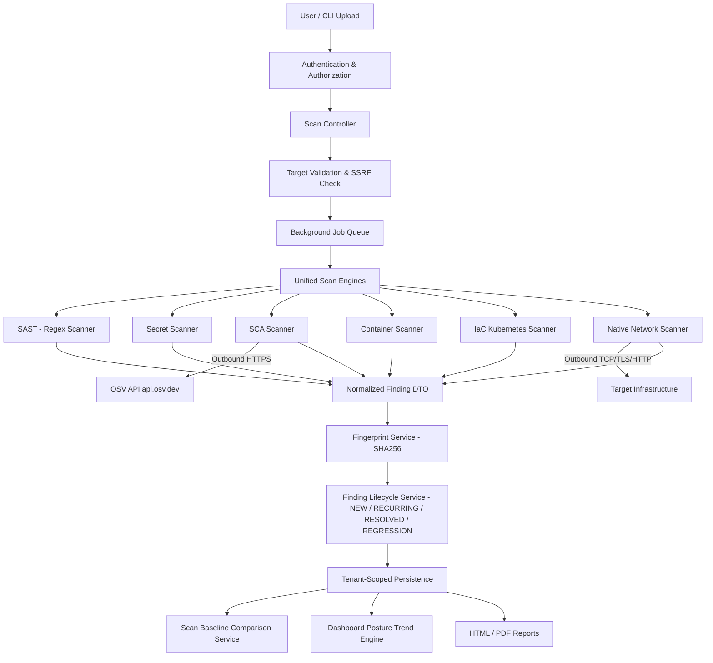

# TrustNode Master Security Capability Baseline

## 1. Executive Summary
This document establishes the verified, source-backed security capability baseline for TrustNode as of the completion of Phase 11.4. It serves as the authoritative record of what TrustNode implements, how it interacts with external services, and what verified security boundaries exist.

### Core Security Philosophy
> **"Security starts from the smallest entity/resource."**

TrustNode is designed as a Continuous Security & Remediation Platform that focuses on securing individual resources—source code, dependencies, credentials, container definitions, manifests, and network endpoints—providing the foundation for cumulative organizational security posture tracking.

---

## 2. Architecture
TrustNode is structured as a self-hosted platform managing background job execution, deterministic finding lifecycle intelligence, baseline comparison, and tenant-isolated findings persistence.

---

## 3. Capability Scorecard
| Category | Status | Summary |
|----------|--------|---------|
| **Code Security** | 🟡 PARTIAL | Pattern-based SAST for SQLi, Command Injection, dangerous eval, and path traversal |
| **Secret Security** | ✅ IMPLEMENTED | High-entropy tokens, cloud/API tokens (AWS, GitHub, GitLab, Stripe, Slack, GCP, JWT, Private Keys) with masking and placeholder filtering |
| **Dependency / SCA Security** | 🟡 PARTIAL | Lockfile analysis for `composer.lock`, `package-lock.json` (v1-v3), `yarn.lock` (v1), and `pnpm-lock.yaml` (v5/v6/v9) via OSV.dev |
| **Container Security** | 🟡 PARTIAL | Static analysis of `Dockerfile` and `docker-compose.yml` configurations |
| **IaC / Cloud Posture** | 🟡 PARTIAL | Offline static analysis of Kubernetes YAML manifests |
| **Network Security** | 🟡 PARTIAL | Active TCP port probing, TLS certificate expiration inspection, and HTTP security headers |
| **Cloud / CNAPP** | 🚧 PLANNED | Planned cloud provider posture scanning (CSPM), identity entitlements (CIEM), and workload protection (CWPP) |
| **SOC / Detection** | 🟡 PARTIAL | Finding normalization, SHA-256 fingerprinting, 4-state lifecycle tracking, point-to-point baseline regression comparison, and posture trend dashboard |
| **Compliance** | 🧪 EXPERIMENTAL | Heuristic control mapping for OWASP Top 10, MITRE ATT&CK, ISO 27001, PCI DSS, NIST SP 800-53, and SOC 2 |
| **Reporting** | ✅ IMPLEMENTED | Generation of styled HTML and downloadable PDF audit reports detailing findings, remediation steps, and technical evidence |
| **Scanning Targets** | ✅ IMPLEMENTED | Scan execution across local directories (CLI upload), Git repositories (clone), uploaded ZIP archives, and verified network infrastructure hosts |
| **Platform / Operations** | ✅ IMPLEMENTED | Multi-tenant context isolation (`TenantScope`), background queue execution, strict archive extraction boundaries, and SSRF/DNS rebinding protection |

> **Status Vocabulary:**
> - ✅ **IMPLEMENTED** — Fully functional, tested, and actively available in the codebase.
> - 🟡 **PARTIAL** — Available with specific boundaries or supported subsets.
> - 🧪 **EXPERIMENTAL** — Heuristic or foundational capability under active development.
> - 🚧 **PLANNED** — Roadmap capability designed for future implementation.

---

## 4. Master Capability Matrix
| Capability | Status | Source | Tests | Boundaries & Limitations |
|------------|--------|--------|-------|--------------------------|
| **Regex SAST** | ✅ IMPLEMENTED | `app/Services/Scan/Scanners/SastScanner.php` | `SastScannerTest.php` | Regex pattern matching; does not perform AST or taint analysis. |
| **Secret Detection** | ✅ IMPLEMENTED | `app/Services/Scan/Scanners/SecretScanner.php` | `SecretScannerTest.php` | Shannon entropy filtering (>= 3.5), known provider tokens, placeholder filtering, credential masking. |
| **SCA (Lockfile Analysis)** | ✅ IMPLEMENTED | `app/Services/Scan/Scanners/ScaScanner.php` | `ScaScannerTest.php` | PHP (`composer.lock`), Node (`package-lock.json` v1-v3, `yarn.lock` Classic v1, `pnpm-lock.yaml` v5/v6/v9). |
| **OSV API Integration** | ✅ IMPLEMENTED | `app/Services/Scan/Vulnerability/OsvApiClient.php` | `OsvApiClientTest.php` | Batched lookup (up to 500 packages), 10s timeout, 3 retries, Redis caching (safe: 24h, vuln: 7d). |
| **Dockerfile Analysis** | ✅ IMPLEMENTED | `app/Services/Scan/Scanners/ContainerScanner.php` | `ContainerScannerTest.php` | Static regex parsing for `LATEST`, `ROOT`, `CURL-BASH`, `ADD`. |
| **Docker Compose Analysis** | ✅ IMPLEMENTED | `app/Services/Scan/Scanners/ContainerScanner.php` | `ContainerScannerTest.php` | Static analysis for `PRIVILEGED`, `SOCK`, `HOST-NET`. |
| **Kubernetes Static Analysis** | ✅ IMPLEMENTED | `app/Services/Scan/Scanners/KubernetesScanner.php` | `KubernetesScannerTest.php` | Offline regex/structural analysis for Privileged, HostNetwork, HostPID, HostPath, PrivilegeEscalation, RunAsRoot, PublicService. |
| **Port Scanning** | ✅ IMPLEMENTED | `app/Services/Scan/Infrastructure/NativeInfrastructureScanner.php` | `NativeNetworkScannerTest.php` | Fixed array of 14 common ports (21, 22, 23, 25, 53, 80, 110, 143, 443, 3306, 3389, 5432, 8080, 8443). |
| **TLS Certificate Inspection** | ✅ IMPLEMENTED | `app/Services/Scan/Infrastructure/NativeInfrastructureScanner.php` | `NativeNetworkScannerTest.php` | Expiration checking via `stream_socket_client` on ports 443, 8443. |
| **HTTP Security Headers** | ✅ IMPLEMENTED | `app/Services/Scan/Infrastructure/NativeInfrastructureScanner.php` | `NativeNetworkScannerTest.php` | Missing security header inspection via HEAD requests with DNS rebinding protection. |
| **Tenant Context Isolation** | ✅ IMPLEMENTED | `app/Scopes/TenantScope.php`, `app/Context/TenantContext.php` | `TenantIsolationTest.php` | Automatic query scoping and queue job context propagation. |
| **Archive Extraction Safety** | ✅ IMPLEMENTED | `app/Jobs/ScanLocalJob.php` | `ArchiveSecurityTest.php` | Bounded file count (50,000), max uncompressed size (200 MB), Zip Slip directory traversal prevention. |
| **Finding Lifecycle Intelligence** | ✅ IMPLEMENTED | `app/Services/Finding/FindingLifecycleService.php`, `app/Models/FindingIdentity.php` | `FindingLifecycleIntelligenceTest.php` | Deterministic tracking of `NEW`, `RECURRING`, `RESOLVED`, `REGRESSION` states across completed scans. |
| **Security Baseline Comparison** | ✅ IMPLEMENTED | `app/Services/Scan/ScanBaselineComparisonService.php` | `ScanBaselineRegressionTest.php` | Point-to-point scan comparison, severity delta calculation, regression details, and posture direction evaluation. |
| **Security Posture Dashboard** | ✅ IMPLEMENTED | `app/Services/Dashboard/DashboardService.php` | `SecurityPostureDashboardTest.php` | Tenant-scoped lifecycle summary, 10-scan historical trend, and posture direction calculation (`improving`, `worsening`, `unchanged`). |

---

## 5. Scanner Inventory & Specifications

| Scanner | Category | Input Format | Rule Count / Coverage | Network Access Required |
|---|---|---|---|---|
| **SastScanner** | SAST | Source code files | 4 rules (SQLi, CMD, Eval, Path Traversal) | No |
| **SecretScanner** | Secret Detection | Source code files | 9 rules (AWS, GitHub, GitLab, Stripe, Slack, GCP, JWT, Private Keys, Generic Entropy) | No |
| **ScaScanner** | SCA | Lockfiles (`composer.lock`, `package-lock.json`, `yarn.lock`, `pnpm-lock.yaml`) | Dynamic vulnerability lookup via OSV database | Yes (`api.osv.dev`) |
| **ContainerScanner** | Container Security | `Dockerfile`, `docker-compose.yml` | 7 static rules | No |
| **KubernetesScanner** | IaC Security | Kubernetes YAML manifests | 7 static rules | No |
| **NativeInfrastructureScanner** | Network Security | Hostname / IP address | Port checks, TLS validity, HTTP header audit | Yes (Target host) |

---

## 6. Code Security (SAST)
- **Current Status:** 🟡 PARTIAL
- **Implementation:** Pattern-based regular expression scanner (`SastScanner.php`, `AbstractRegexScanner.php`).
- **Active Rules:**
  - `SEC-SAST-SQLI`: Direct SQL concatenation / raw queries.
  - `SEC-SAST-CMD`: Shell execution functions (`exec`, `system`, `passthru`, `shell_exec`, `proc_open`).
  - `SEC-SAST-EVAL`: Dynamic code execution (`eval`).
  - `SEC-SAST-PATH`: Arbitrary path traversal and file inclusion.
- **Boundaries & Limitations:**
  - Fast, lightweight cross-language scanning.
  - Does not evaluate ASTs, call graphs, or data-flow taint tracking.
- **Planned Direction:** 🚧 AST-based syntax analysis and framework-aware rule sets.

---

## 7. Secret Security
- **Current Status:** ✅ IMPLEMENTED
- **Implementation:** Regular expressions combined with Shannon entropy filtering (`SecretScanner.php`).
- **Features:**
  - Entropy threshold enforcement (entropy >= 3.5 for generic high-entropy strings).
  - Common placeholder filtering (`example`, `test`, `placeholder`, `secret`, `changeme`).
  - Automatic credential masking (retains only the first and last 4 characters in stored evidence).
  - Evidence truncation to prevent oversized log entries (symmetric 2,000 character limit).
- **Rule Set:** AWS Access/Secret Keys, GitHub Tokens, GitLab Tokens, Stripe API Keys, Slack Tokens/Webhooks, Google Cloud API Keys, JSON Web Tokens (JWT), Private Keys (RSA/DSA/EC/OPENSSH/PGP), and Generic High-Entropy Secrets.

---

## 8. Dependency / Software Composition Analysis (SCA)
- **Current Status:** 🟡 PARTIAL
- **Implementation:** Lockfile parsers integrated with the Google OSV API (`ScaScanner.php`, `OsvApiClient.php`).
- **Supported Ecosystems:**
  - PHP: `composer.lock` (`ComposerLockParser.php`)
  - Node.js: `package-lock.json` versions 1, 2, and 3 (`NpmLockParser.php`)
  - Yarn: `yarn.lock` Classic v1 (`YarnLockParser.php`)
  - pnpm: `pnpm-lock.yaml` versions 5, 6, and 9 (`PnpmLockParser.php`)
- **Operational Boundaries:**
  - Batched requests up to 500 dependencies per payload to `api.osv.dev`.
  - Configured 10-second timeout with up to 3 retries on transient errors.
  - Response caching: 24 hours for clean packages, 7 days for packages with known vulnerabilities.
  - Resilient execution: If OSV.dev is unreachable, SCA logs a warning and the scan finishes cleanly without failing.
- **Planned Direction:** 🚧 Yarn Berry (v2+), Python (`requirements.txt`, `Pipfile.lock`, `poetry.lock`), Go (`go.sum`), Rust (`Cargo.lock`), Maven (`pom.xml`), and Gradle.

---

## 9. Container Security
- **Current Status:** 🟡 PARTIAL
- **Implementation:** Static analysis of container configuration files (`ContainerScanner.php`).
- **Active Rules:**
  - Dockerfile: Untagged/latest base images (`LATEST`), container execution as root (`ROOT`), pipe-to-bash downloads (`CURL-BASH`), dangerous remote `ADD` instructions.
  - Docker Compose: Privileged mode (`PRIVILEGED`), mounting host Docker sockets (`SOCK`), host network mode sharing (`HOST-NET`).
- **Boundaries & Limitations:**
  - Static configuration file analysis only.
- **Planned Direction:** 🚧 Container image layer scanning, registry integrations, and container runtime security.

---

## 10. Infrastructure-as-Code (IaC) & Cloud Posture
- **Current Status:** 🟡 PARTIAL
- **Implementation:** Offline static analysis of Kubernetes YAML manifests (`KubernetesScanner.php`).
- **Active Rules:**
  - Privileged containers (`privileged: true`)
  - Host namespace sharing (`hostNetwork`, `hostPID`)
  - Sensitive host volume mounts (`hostPath`)
  - Privilege escalation allowance (`allowPrivilegeEscalation: true`)
  - Root user execution (`runAsUser: 0`, missing non-root constraints)
  - Public exposure via `Type: LoadBalancer`
- **Boundaries & Limitations:**
  - Pure offline static analysis; requires no external cluster connections.
- **Planned Direction:** 🚧 Terraform (HCL), Helm charts, and live cloud provider infrastructure scanning (CSPM).

---

## 11. Network Security
- **Current Status:** 🟡 PARTIAL
- **Implementation:** Active infrastructure scanner (`NativeInfrastructureScanner.php`).
- **Checks Performed:**
  - TCP port connectivity across 14 standard ports (21, 22, 23, 25, 53, 80, 110, 143, 443, 3306, 3389, 5432, 8080, 8443).
  - TLS certificate expiration check on SSL ports (443, 8443) via `stream_socket_client`.
  - Missing HTTP security headers (Strict-Transport-Security, Content-Security-Policy, X-Frame-Options, X-Content-Type-Options, Referrer-Policy, Permissions-Policy).
- **Protections:**
  - Strict SSRF protection via `TargetValidator.php` (blocks private/loopback/link-local IPv4 and IPv6 ranges).
  - DNS rebinding mitigation using pinned IP resolution (`CURLOPT_RESOLVE`) and `peer_name` validation.
- **Planned Direction:** 🚧 Full port scanning, service banner grabbing, and network vulnerability profiling.

---

## 12. Cloud / CNAPP
- **Current Status:** 🚧 PLANNED
- **Roadmap Scope:**
  - Cloud Security Posture Management (CSPM) via read-only cloud provider APIs (AWS, Azure, GCP).
  - Cloud Infrastructure Entitlement Management (CIEM).
  - Cloud Workload Protection Platform (CWPP) capabilities.
- **Current Reality:**
  - No cloud-provider SDKs or runtime agent connectors exist in the current implementation.

---

## 13. SOC / Detection & Finding Intelligence
- **Current Status:** 🟡 PARTIAL
- **Implementation:**
  - **Normalized Findings**: Uniform DTO schema across all scanner types.
  - **Finding Identity**: Unique SHA-256 fingerprint generated per rule, target, and location.
  - **Finding Lifecycle Intelligence**: Real-time state determination (`NEW`, `RECURRING`, `RESOLVED`, `REGRESSION`) evaluated against completed scans within tenant and target boundaries.
  - **Security Baseline Comparison**: Point-to-point delta analysis between any two scans, identifying newly introduced vulnerabilities, resolved findings, and posture shifts.
  - **Posture Dashboard & Trends**: Aggregated historical metrics, 10-scan trend visualizations, and direction calculation (`improving`, `worsening`, `unchanged`).
- **Boundaries & Limitations:**
  - TrustNode is a continuous scanning and remediation platform, not a full SIEM, SOAR, or live endpoint detection system.
- **Planned Direction:** 🚧 Webhook alerts, ticketing integration (Jira, GitHub Issues), and SIEM log streaming.

---

## 14. Compliance
- **Current Status:** 🧪 EXPERIMENTAL
- **Implementation:** Heuristic control mapper linking findings to compliance frameworks based on category and rule tags (`ComplianceMapper.php`, `ComplianceSeeder.php`).
- **Mapped Frameworks:**
  - OWASP Top 10
  - MITRE ATT&CK
  - ISO/IEC 27001
  - PCI DSS
  - NIST SP 800-53
  - SOC 2
- **Boundaries & Limitations:**
  - Provides heuristic alignment for developer awareness.
  - Does NOT represent formal compliance certification or evidence collection for formal audit readiness.

---

## 15. Platform & Operational Controls
- **Current Status:** ✅ IMPLEMENTED
- **Tenant Isolation**: Strict isolation enforced via Laravel global `TenantScope` and `TenantContext`. All scan records, findings, and identities are tenant-scoped.
- **Queue & Background Jobs**: Asynchronous execution for repository cloning, local archive unpacking, scanner dispatch, and lifecycle computation (`ScanLocalJob`, `ScanRepositoryJob`, `ScanInfrastructureJob`).
- **Archive Safety**: Memory-bounded extraction, file count limits (50,000 max), decompressed size ceilings (200 MB max), and path sanitization preventing Zip Slip attacks.
- **SSRF Prevention**: Strict hostname resolution and private IP blacklisting enforced before initiating outbound network connections.

---

## 16. Security Reporting
- **Current Status:** ✅ IMPLEMENTED
- **HTML Reports**: Dynamic, styled view with color-coded severity badges, technical evidence snippets, and clear remediation guidance.
- **PDF Reports**: Downloadable, print-ready security audit summaries generated using Laravel DomPDF.

---

## 17. External Network Dependencies
| External Service | Purpose | Data Sent | Failure Handling |
|---|---|---|---|
| `api.osv.dev` | Dependency vulnerability lookups | Ecosystem, package name, version | Graceful fallback; scan continues, SCA findings skipped, warning logged |
| Target Infrastructure | Network and TLS probing | Target hostname / IP | Bounded timeout; failure logged, scan completes |
| Git Remotes | Cloning remote repositories | Git clone protocol / authentication token | Job fails with descriptive error, temporary directory cleaned |

---

## 18. Verified Safety Limits
- **Archive Upload Size**: 100 MB max compressed
- **Decompressed Size**: 200 MB max uncompressed
- **File Count Limit**: 50,000 files per archive
- **Per-File Read Limit**: 5 MB max
- **Evidence Truncation**: 2,000 characters symmetrically
- **OSV Timeout & Retries**: 10s timeout, 3 retries (1000ms exponential backoff)
- **Network Probing Timeouts**: 1.5s TCP timeout, 3.0s TLS timeout, 5.0s HTTP timeout

---

## 19. Documentation Maintenance Rules
1. `README.md` and `SECURITY_CAPABILITY_BASELINE.md` are the authoritative source-backed technical records.
2. Capability statuses must strictly use:
   - ✅ `IMPLEMENTED`
   - 🟡 `PARTIAL`
   - 🧪 `EXPERIMENTAL`
   - 🚧 `PLANNED`
3. When new scanner capabilities, parsers, or services are added:
   - Implement the feature and write tests.
   - Run the automated test suite.
   - Update `README.md` and `SECURITY_CAPABILITY_BASELINE.md` simultaneously.
