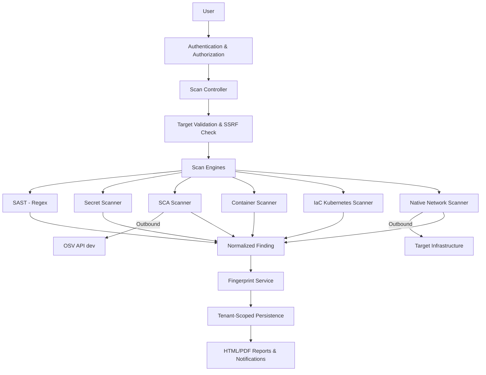

# TrustNode Master Security Capability Baseline

## 1. Executive Summary
This document establishes the verified, source-backed security capability baseline for TrustNode as of the completion of Phase 10.7. It serves as the authoritative record of what TrustNode implements, how it interacts with external services, and what verified security gaps exist. 

## 2. Architecture
TrustNode is structured as a self-hosted platform managing background job execution and tenant-isolated findings persistence. 

## 3. Capability Scorecard
| Category | Status |
|----------|--------|
| Code Security | 🟡 PARTIAL |
| Secret Security | ✅ IMPLEMENTED |
| Dependency / SCA | 🟡 PARTIAL |
| Container Security | 🟡 PARTIAL |
| IaC / Cloud Posture | 🟡 PARTIAL |
| Network Security | 🟡 PARTIAL |
| Cloud / CNAPP | ❌ NOT IMPLEMENTED |
| SOC / Detection | 🟡 PARTIAL |
| Compliance | 🧪 EXPERIMENTAL |
| Reporting | ✅ IMPLEMENTED |
| Scanning Targets | ✅ IMPLEMENTED |
| Platform / Operations | ✅ IMPLEMENTED |

## 4. Master Capability Matrix
| Capability | Status | Source | Tests | Limitations |
|------------|--------|--------|-------|-------------|
| Regex SAST | IMPLEMENTED | `SastScanner.php` | `SastScannerTest` | Regex only, high false positives |
| Secret Detection | IMPLEMENTED | `SecretScanner.php` | `SecretScannerTest` | Checks entropy & placeholders |
| SCA (Lockfile Analysis) | IMPLEMENTED | `ScaScanner.php` | `ScaScannerTest` | Limited to PHP/Node ecosystems |
| OSV API Integration | IMPLEMENTED | `OsvApiClient.php` | Mocked Tests | Requires outbound internet access |
| Dockerfile Analysis | IMPLEMENTED | `ContainerScanner.php` | `ContainerScannerTest` | Regex parsing only |
| K8s Static Analysis | IMPLEMENTED | `KubernetesScanner.php` | `KubernetesScannerTest` | Basic manifest rules only |
| Port Scanning | IMPLEMENTED | `NativeInfrastructureScanner.php` | `NativeNetworkScannerTest` | Fixed top ports list |
| TCP TLS Checks | IMPLEMENTED | `NativeInfrastructureScanner.php` | `NativeNetworkScannerTest` | 443, 8443 only |
| HTTP Header Checks | IMPLEMENTED | `NativeInfrastructureScanner.php` | `NativeNetworkScannerTest` | Head request missing checks |
| Tenant Context Isolation | IMPLEMENTED | `TenantScope.php`, `AppServiceProvider.php` | `TenantIsolationTest.php` | |
| Archive Extraction Safety| IMPLEMENTED | `ScanLocalJob.php` | `ArchiveSecurityTest.php` | Bounded memory extraction |
| Finding Lifecycle Intelligence | IMPLEMENTED | `FindingLifecycleService.php`, `FindingIdentity.php` | `FindingLifecycleIntelligenceTest.php` | NEW, RECURRING, RESOLVED, REGRESSION state tracking within target/tenant boundaries |
| Security Baseline & Regression Intelligence | IMPLEMENTED | `ScanBaselineComparisonService.php` | `ScanBaselineRegressionTest.php` | Deterministic baseline identification, scan delta, severity changes, regression details, and posture assessment |

## 5. Scanner Inventory
| Scanner | Category | Input | Rules | Network Access | Status |
|----------|----------|-------|-------|----------------|--------|
| SastScanner | SAST | Source | 4 (SQLi, CMD, Eval, Path) | No | IMPLEMENTED |
| SecretScanner | Secret | Source | 9 (Tokens, Keys) | No | IMPLEMENTED |
| ScaScanner | SCA | Lockfiles | Dynamic via OSV | Yes (api.osv.dev) | IMPLEMENTED |
| ContainerScanner | Container | Dockerfile/Compose | 7 Container rules | No | IMPLEMENTED |
| KubernetesScanner | IaC | YAML | 7 Kubernetes rules | No | IMPLEMENTED |
| NativeInfrastructureScanner | Network | Host/IP | Port, TLS, Header | Yes (Target) | IMPLEMENTED |

## 6. SAST
- **Implemented:** Regex SAST
- **Not Implemented:** AST SAST, framework-aware analysis, data-flow analysis, taint analysis.
- **Rules:** SEC-SAST-SQLI, SEC-SAST-CMD, SEC-SAST-EVAL, SEC-SAST-PATH.

## 7. Secret Security
- **Detection Method:** Regex + Shannon Entropy (>= 3.5) + Placeholder filtering.
- **Evidence Handling:** Masks credentials retaining only first/last 4 chars.
- **Rules:** AWS, GitHub, GitLab, Stripe, Slack, GCP, Private Key, JWT, Generic.

## 8. SCA
- **Supported Ecosystems:** Packagist (`composer.lock`), npm (`package-lock.json` v1/v2/v3), Yarn (`yarn.lock` Classic), pnpm (`pnpm-lock.yaml` v5/v6/v9).
- **Unsupported Ecosystems:** Yarn Berry, Python, Go, Rust, Maven, Gradle.
- **Behavior:** Batches up to 500 packages per request, 10s timeout, 3 retries (for HTTP 429/500+). Caches safe records for 24h, vulnerable records for 7 days.

## 9. Container Security
- **Implemented:** Dockerfile analysis (LATEST, ROOT, CURL-BASH, ADD), Compose analysis (PRIVILEGED, SOCK, HOST-NET).
- **Not Implemented:** Image scanning, registry scanning, runtime monitoring, Kubernetes runtime.

## 10. IaC
- **Implemented:** Kubernetes manifest static analysis (Privileged, HostNetwork, HostPID, HostPath, PrivilegeEscalation, RunAsRoot, PublicService).
- **Not Implemented:** Terraform, Helm, Cloud posture, cluster API integration.

## 11. Network Security
- **Target Types:** Domains and IPs (SSRF protections enforce public IPs only via `TargetValidator`).
- **Ports Evaluated:** Fixed Array (21, 22, 23, 25, 53, 80, 110, 143, 443, 3306, 3389, 5432, 8080, 8443).
- **Checks:** TCP Socket Connection, TLS Expiration via `stream_socket_client`, Missing HTTP Security Headers via `curl` (HEAD).
- **Protections:** Rebinding protected using `CURLOPT_RESOLVE` and `peer_name`. Does not follow redirects.

## 12. Cloud/CNAPP
- **Status:** ❌ NOT IMPLEMENTED
- No AWS, Azure, GCP SDKs exist. No CSPM, CWPP, CIEM.

## 13. SOC/Detection
- **Status:** 🟡 PARTIAL
- Finding normalization and fingerprint deduplication is implemented.
- Finding Lifecycle Intelligence is implemented: deterministic tracking of `NEW`, `RECURRING`, `RESOLVED`, and `REGRESSION` finding states across historical completed scans within tenant and target boundaries.
- Security Baseline & Regression Intelligence is implemented: deterministic baseline identification, scan delta, severity changes, regression details, and posture direction calculation (`improving`, `worsening`, `unchanged`, `initial_baseline`).
- Triage states, severities, HTML/PDF exports exist.
- No incident case management, SIEM integrations, SOAR workflows, correlation, anomaly baselines, threat hunting, cloud posture management, or predictive risk analytics.

## 14. Compliance
- **Status:** 🧪 EXPERIMENTAL
- Implements heuristic mapping based on finding tags.
- Not a formal compliance GRC tool. No audit management or evidence collection infrastructure.

## 15. Platform/Operations
- **Status:** ✅ IMPLEMENTED
- HTTP and Background Job tenant boundaries enforced via `TenantScope` and `TenantContext`.
- Archive extraction strictly bounded to prevent Zip Slip and Decompression Dos.
- SSRF enforced for repositories and targets.

## 16. Reporting
- HTML/PDF outputs render Severity, Category, Title, Description, Technical Details, Evidence, Remediation, CVE/OSV references.

## 17. External Network Dependencies
| Service | Purpose | User Target? | Required? | Data Sent |
|---------|---------|--------------|-----------|-----------|
| `api.osv.dev` | Vulnerability Intel | No | Yes (SCA only) | Ecosystem, package name, version |
| Target Infra | Network Scanning | Yes | Yes (Infra only)| HTTP Headers, TCP Handshakes |
| GitHub API | Target Repo Connect | Yes | Yes (Repo only)| Validates API token |

## 18. Resource Limits
- OSV API: 10 second timeout, 3 retries.
- Network Scanner: 1.5s TCP timeout, 3.0s TLS timeout, 5.0s Curl timeout.
- Background Archive: Bound file count/decompressed sizing enforced during extraction. Evidence truncated at 2000 chars.

## 19. Security Boundaries
Tenant isolation operates strictly through the Laravel global `TenantScope`. Background Jobs inherit this by registering early in the `Queue::before` event and unwinding on `Queue::after`. Direct object interaction mandates policy checks. 

## 20. Verified Security Gaps
- Regex SAST yields false positives and cannot evaluate data flows.
- Network Scanning is limited to 14 basic ports and does not identify complex infrastructure vulns.
- No continuous runtime cloud or container scanning capability.
- No support for Infrastructure-as-Code tooling outside raw Kubernetes YAML manifests.

## 21. Verification/Test Matrix
273 executed tests asserting HTTP Tenant Isolation, Background Queue Contexts, SSRF rejections, Archive limits, JSON validation, and core CRUD logic. Total assertions: 790.

## 22. Roadmap
Future goals involve integrating an AST parsing engine for SAST, runtime container analysis via Trivy, and Terraform state analysis.

## 23. Documentation Maintenance Rules
This document reflects verified codebase capabilities. Claims of security support must be backed by implemented executable logic. Do not market experimental features as Enterprise Grade.
